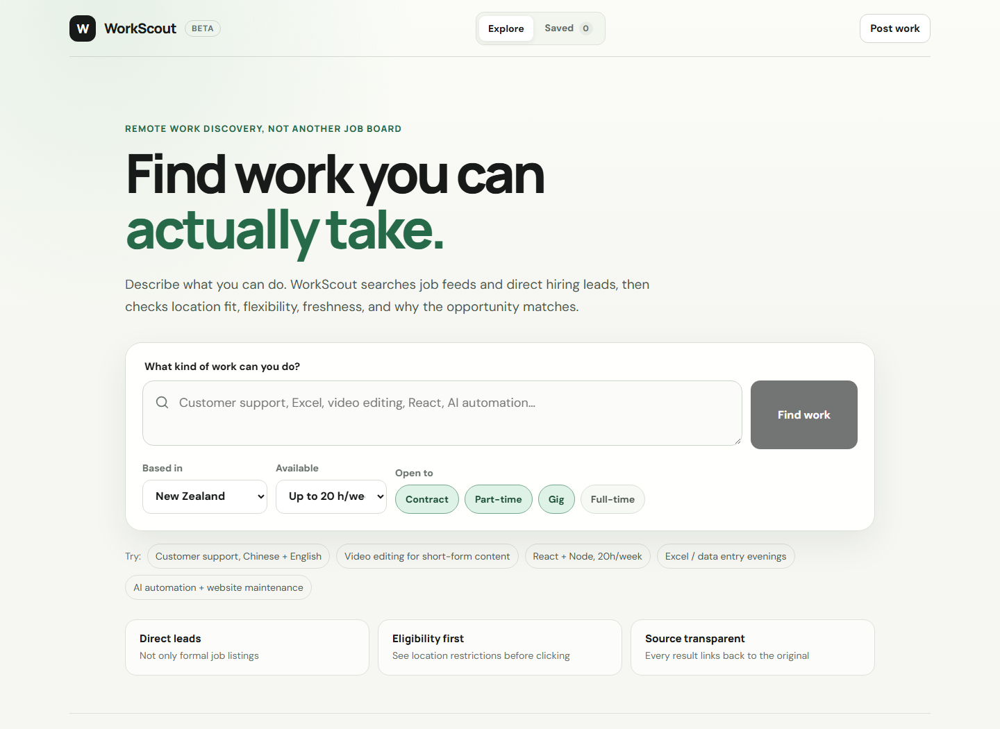

# WorkScout

[](https://github.com/yaohuangguan/work-scout/actions/workflows/ci.yml) [](https://workscout.samyao.me)

**Find remote work you can actually take.**

WorkScout searches both traditional remote-job feeds and direct hiring leads, then ranks opportunities by skill match, location eligibility, flexibility, and freshness — without hiding the original source.

[Live app](https://workscout.samyao.me) · [Report a bug](https://github.com/yaohuangguan/work-scout/issues/new?template=bug_report.yml) · [Request a feature](https://github.com/yaohuangguan/work-scout/issues/new?template=feature_request.yml)



## Why WorkScout exists

Remote work is easy to search for and surprisingly hard to **actually qualify for**.

A listing may say “remote” but still require a specific country, timezone, employment status, or 40-hour schedule. Meanwhile, some of the best opportunities are not formal job listings at all — they are posts such as:

> Looking for someone to finish a Shopify checkout flow.

> Need a video editor for short-form content.

> Hiring a remote developer for a paid code review and launch work.

WorkScout treats all of these as **work opportunities**, not just job titles.

## What makes it different

| | Typical remote job board | WorkScout |
| --- | --- | --- |
| Formal job listings | Yes | Yes |
| Direct freelance / hiring leads | Usually no | Yes |
| Country eligibility surfaced early | Sometimes | Yes |
| Weekly availability considered | Rarely | Yes |
| Original source preserved | Varies | Always |
| “Why this matched” explanation | Rarely | Yes |
| Search by what you can do | Limited | Yes |
| Community work posting | Sometimes | Yes |

## Product v1

### Search across jobs and direct leads

Current discovery sources:

- **Reddit r/forhire** — only fresh `[Hiring]` posts
- **Hacker News freelancer threads** — only `SEEKING FREELANCER` comments
- **Himalayas**
- **Remote OK**
- **Remotive**
- **WorkScout community posts**

All source adapters normalize into the same `WorkItem` model before ranking and deduplication.

### Search in normal language

You can search for work like:

```text
Customer support, Chinese + English
Video editing for short-form content
React + Node, 20h/week
Excel / data entry evenings
AI automation + website maintenance
```

WorkScout expands the request into useful search terms, retrieves matching opportunities, and ranks them against your constraints.

### Eligibility before the click

Results surface:

- remote scope
- country / region restrictions
- contract, gig, part-time, or full-time signals
- freshness
- source
- salary / budget when available
- why the opportunity surfaced

The goal is to reduce the common “Remote — US only” dead end.

### Direct leads get their own treatment

Direct hiring posts are marked as **Lead** and can be filtered separately from normal jobs.

A lead is intentionally ranked differently from a generic job listing because it is often:

- more immediate
- more flexible
- closer to freelance / contract work
- easier to contact directly

### Save and revisit

The current version supports:

- saved opportunities
- recent searches
- source filters
- 7 / 30 day freshness filters
- “Looks eligible” filtering
- flexible-work filtering
- direct-lead filtering

Saved bookmarks stay on the device for now, so basic discovery still works without requiring an account.

### Scout Watch

Any live search can become a **Scout Watch**.

WorkScout stores the search constraints in D1. An hourly Cloudflare Cron scheduler refreshes the oldest watches that have been due for at least 6 hours. A watch keeps a baseline of already-known opportunities and marks only newly discovered matches as **New**.

Watch matching is intentionally stricter than interactive search:

- the opportunity must contain explicit keyword-match evidence
- restricted locations are excluded
- low-score results are excluded
- previously seen opportunities are deduplicated by item ID

The browser generates an opaque random client key. The server stores only its SHA-256 hash, so watches can persist without introducing user accounts.

### Apply Pipeline

Promising opportunities can be moved through:

`Saved → Contacted → Applied → Interview → Offer / Closed`

Pipeline state is persisted in D1 against the same anonymous client hash. The UI provides a lightweight kanban view plus status controls directly from an opportunity detail view.

This turns WorkScout from a discovery-only tool into a workflow that continues after the first click.

### Post work

Anyone can publish a small piece of remote work into the WorkScout community pool.

The first release includes:

- direct email or application URL contact
- Cloudflare D1 persistence through `openmesh-node/db`
- OpenMesh request validation, body parsing, middleware, and error handling inside the Worker
- honeypot bot protection
- per-connection posting throttling
- hashed fingerprints instead of raw IP storage
- automatic cleanup of old throttle records

## Architecture

WorkScout remains a Cloudflare Worker application. The HTTP runtime inside the Worker is now OpenMesh 0.5 instead of Hono.

```text
React / Vite assets
    |
    +-----------------------------> ASSETS binding
    |
    | /api/*
    v
Cloudflare Worker fetch()
    |
    | handleAsNodeRequest()
    v
OpenMesh HTTP runtime
    |
    +--> typed routes / middleware / body parsing
    +--> Reddit / HN / remote-job APIs
    +--> Scout Watch + Apply Pipeline APIs
    +--> openmesh-node/db
            |
            v
        Cloudflare D1

Cloudflare Cron (every 6 hours)
    |
    +--> refresh due Scout Watches
    +--> persist only newly discovered matches
```

Cloudflare's Node compatibility layer provides the `node:http` server APIs OpenMesh uses. The OpenMesh server listens on a Worker-local virtual port; `cloudflare:node` bridges Worker requests into it.

There is no separate VM, container, Node host, Postgres service, or second production stack.

More detail: [architecture](docs/ARCHITECTURE.md).

## Search visibility

WorkScout keeps the interactive React app at the root while generating a small set of crawlable static landing pages and practical guides for distinct search intents.

The SEO surface includes canonical URLs, sitemap/robots controls, Open Graph metadata, structured data, breadcrumb markup, a real 404, API noindex headers, crawlable internal links, and static HTML content for crawlers that do not execute JavaScript.

See [SEO architecture and launch checklist](docs/SEO.md).

## Why the core search does not require an LLM

The product intentionally keeps its critical path deterministic and inexpensive.

Today, WorkScout can search and rank without any model key. That means a model outage, quota problem, or billing issue does not break the basic product.

An optional LLM layer is a strong next step for:

- semantic query expansion
- unstructured lead classification
- ambiguous timezone / country interpretation
- better summaries
- scam and low-quality signals
- matching work to a richer user profile

The model should enhance discovery — not become the crawler.

## Stack

- **Frontend:** React 19, TypeScript, Vite
- **Backend runtime:** OpenMesh 0.5 on Cloudflare Workers
- **Worker bridge:** `node:http` + `cloudflare:node`
- **Database:** Cloudflare D1 through `openmesh-node/db`
- **Discovery sources:** Reddit, Hacker News, Himalayas, Remote OK, Remotive
- **Testing:** Vitest + real Wrangler end-to-end smoke test
- **CI:** GitHub Actions
- **Deployment:** Wrangler

## Run locally

Requirements:

- Node.js 24
- npm

```bash
git clone https://github.com/yaohuangguan/work-scout.git
cd work-scout

npm install
npm run dev
```

The default development command starts Wrangler and Vite.

Then open:

- UI: `http://localhost:5173`
- OpenMesh Worker API: `http://localhost:8787`

Vite proxies `/api` to the Worker, so the frontend and production API contract stay identical.

## Verify before changing main

```bash
npm run check
npm run smoke
```

`npm run check` runs:

1. Wrangler Worker type generation
2. TypeScript across UI and Worker
3. source-adapter tests
4. a real OpenMesh control-plane/service-discovery test using `app.mesh()`
5. frontend production build

The smoke test starts the real local Wrangler runtime and verifies the OpenMesh Worker, D1 community flow, Scout Watch baseline/new-match behavior, Apply Pipeline persistence, and SPA assets:

- OpenMesh Worker health
- D1 readiness
- live external search
- community publishing through `openmesh-node/db`
- immediate searchability of a new post
- public post listing does not expose contact data
- SPA asset serving

## Deploy

OpenMesh runs inside the existing Cloudflare Worker, so deployment stays the same:

```bash
npm run db:migrate:remote
npm run deploy
```

Cloudflare resources:

- Worker: `workscout`
- D1 database: `workscout-db`
- Production: https://workscout.samyao.me

## Repository structure

```text
.
├── src/                 # React frontend
├── worker/              # OpenMesh Worker API + source adapters/ranking
├── scripts/             # Wrangler end-to-end smoke verification
├── public/              # favicon and web manifest
├── docs/                # architecture, OpenMesh migration, product assets
├── .github/             # CI and contribution templates
├── schema.sql           # shared community schema
├── wrangler.jsonc       # current Worker + D1 + asset bindings
└── vite.config.ts
```

## Roadmap

The next valuable work is deeper discovery coverage rather than turning WorkScout into a heavy marketplace too early.

Near-term priorities:

- Greenhouse / Lever / Ashby discovery
- company career-page indexing
- more public freelance and hiring communities
- saved-search alerts
- optional LLM lead classifier
- better duplicate / stale-listing detection
- source trust and scam signals
- account sync only when cross-device state is worth the complexity

See [open issues](https://github.com/yaohuangguan/work-scout/issues) for active work.

## Contributing

Contributions are welcome.

Please read [CONTRIBUTING.md](CONTRIBUTING.md) before opening a PR. Small source adapters, ranking improvements, parser fixes, test coverage, and UX fixes are especially useful.

## Security

Please do not open a public issue for a vulnerability involving posting abuse, stored data, or Worker / D1 access.

See [SECURITY.md](SECURITY.md).

## License

No explicit open-source license has been selected yet. Until one is added, normal copyright rules apply.
